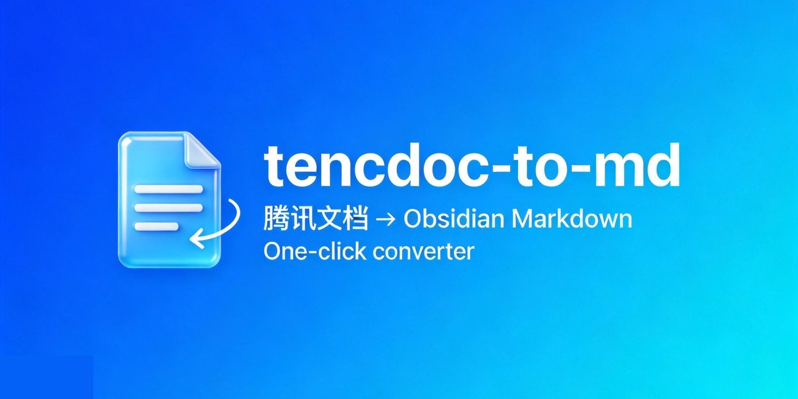
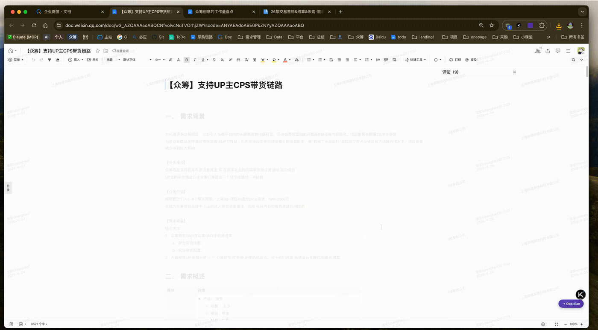

<p align="center">
  
</p>

# tencdoc-to-md

将**腾讯文档 / 企业微信（WeCom）**导出的 `.docx` 文件，转换为 **Obsidian 兼容的 Markdown**。

> 适用于腾讯文档 / 企业微信导出的 docx。通用 Word 文档请用 [docx-to-md](https://github.com/)。

---

## 5 分钟快速上手

```bash
# 1. 安装到 skills 目录
mkdir -p ~/.config/agents/skills
git clone https://github.com/Loki-CHENG/tencdoc-to-md.git ~/.config/agents/skills/tencdoc-to-md
cd ~/.config/agents/skills/tencdoc-to-md

# 2. 安装依赖
brew install pandoc
python3 -m pip install pyyaml --user --break-system-packages

# 3. 配置路径
cp config.example.yaml config.yaml
# 用编辑器打开 config.yaml，填写 docx_dir / output_dir / attachments_dir

# 4. 转换
python3 batch.py
```

---

## 目录

- [核心能力](#核心能力)
- [前置依赖](#前置依赖)
- [安装方式](#安装方式)
- [首次配置](#首次配置)
- [日常使用](#日常使用)
- [Chrome 扩展（一键导出+转换）](#chrome-扩展一键导出转换)
- [Obsidian 附件设置](#obsidian-附件设置)
- [更新方式](#更新方式)
- [部署验证 Checklist](#部署验证-checklist)
- [常见问题](#常见问题)

---

## 核心能力

| 能力 | 说明 |
|------|------|
| 图片提取 | 自动提取内嵌图片，生成 `![[wiki-link]]` 引用 |
| 表格清洗 | 简单表格 → GFM pipe table；复杂表格保留 HTML，智能分配列宽 |
| 下划线还原 | `<u>文字</u>` |
| 高亮还原 | `<span style="background-color: ...">` |
| 文字颜色还原 | `<span style="color: ...">` |
| front matter | 自动注入 title / source / converted_at / author 等字段 |
| 批量转换 | 一条命令处理整个文件夹 |

与通用 docx-to-md 的区别：

| 特性 | tencdoc-to-md | 通用 docx-to-md |
|------|---------------|-----------------|
| 适用来源 | 腾讯文档 / WeCom | 通用 Word 文档 |
| 图片引用 | `![[wiki-link]]` | 标准 Markdown |
| 下划线 / 高亮 | 自动恢复 | 可能丢失 |
| 标题层级 | 智能归一化 | 保持原样 |
| 表格处理 | 智能降级 + 列宽分配 | 保持 HTML |

### 核心技术差异（深度）

以下是与通用 docx-to-md 在**技术实现层面**的本质差异：

| # | 亮点 | 本 skill 做了什么 | 通用工具的问题 |
|---|------|-------------------|----------------|
| 1 | **真实鼠标模拟** | Chrome 扩展通过 `chrome.debugger` + CDP 发送真实鼠标事件，绕过 React `isTrusted` 和 CSS `:hover` 限制，自动触发腾讯文档的导出菜单 | 常规扩展用 DOM API `dispatchEvent`，面对现代 React 组件库子菜单直接不渲染 |
| 2 | **表格原始比例还原** | 直接从 docx XML 提取 `w:tblGrid` 列宽 twips，按原始比例注入 `<colgroup>`，保留原文档排版 | pandoc 输出无列宽信息，Obsidian 中所有列被浏览器均分，排版失真 |
| 3 | **下划线/高亮/颜色恢复** | 在 docx XML 中注入 PUA sentinel 字符，让 pandoc 透传后还原为 `<u>` / `<span style="background-color">` / `<span style="color">` | pandoc 直接丢弃这些格式，通用工具完全丢失 |
| 4 | **腾讯文档指纹识别** | 解析 docx ZIP 内 XML，识别 styles.xml 中 6 位随机 styleId 等腾讯文档特有指纹，自动区分来源 | 无来源识别，通用 Word 和腾讯文档一视同仁，导致特有格式处理错误 |
| 5 | **一键导出流水线** | Chrome 扩展 + Native Messaging：页面点按钮 → 自动导出 docx → 下载 → 本地 Python 转换 → 按钮状态回调，全程无需手动操作 | 手动下载 → 手动拖文件 → 手动运行脚本，三步分离 |
| 6 | **标题层级智能归一** | 解包 list-wrapped heading、剥离 numPr 列表缩进、H2 为最高级自动归一化 | pandoc 常将深层标题误渲染为加粗列表项，需人工修复层级 |

---

## 前置依赖

### 1. Python 3.8+

```bash
python3 --version   # 确认版本
```

### 2. pandoc 2.9+

```bash
# macOS
brew install pandoc

# Ubuntu / Debian
sudo apt install pandoc

# Windows
# 下载：https://pandoc.org/installing.html
```

### 3. Python 包

```bash
# macOS（系统 Python 需要加 --user --break-system-packages）
python3 -m pip install pyyaml --user --break-system-packages
python3 -m pip install python-docx --user --break-system-packages

# Windows / 虚拟环境
pip install pyyaml python-docx
```

> ⚠️ **macOS 注意**：直接运行 `pip install pyyaml` 可能报 `externally-managed-environment` 错误，必须加 `--user --break-system-packages`。这是正常现象，不会破坏系统。

---

## 安装方式

### 方式 A — AI Agent 用户（Claude Code / KimiCode Trae）

安装到统一的 skills 目录，AI 工具会自动识别 `SKILL.md`：

```bash
mkdir -p ~/.config/agents/skills
git clone https://github.com/Loki-CHENG/tencdoc-to-md.git ~/.config/agents/skills/tencdoc-to-md
```

**Claude Code** 额外步骤：

```bash
# 在你的项目目录下创建 skill 软链接
cd /your/project
mkdir -p .claude/skills
ln -s ~/.config/agents/skills/tencdoc-to-md .claude/skills/tencdoc-to-md
```

**KimiCode（Trae）** 额外步骤：

```bash
# 在 Trae 工作区创建 skill 软链接
cd /your/trae-workspace
mkdir -p .kimi/skills
ln -s ~/.config/agents/skills/tencdoc-to-md .kimi/skills/tencdoc-to-md
```

### 方式 B — 命令行直接使用

```bash
git clone https://github.com/Loki-CHENG/tencdoc-to-md.git ~/tools/tencdoc-to-md
cd ~/tools/tencdoc-to-md
```

### 可选：创建快捷别名

在 `~/.zshrc` 或 `~/.bashrc` 中添加，之后可以直接用 `tencdoc` 命令：

```bash
alias tencdoc='python3 ~/.config/agents/skills/tencdoc-to-md/convert.py'
```

生效：

```bash
source ~/.zshrc   # 或 source ~/.bashrc
tencdoc --help
```

---

## 首次配置

### 第一步：验证依赖

```bash
python3 ~/.config/agents/skills/tencdoc-to-md/scripts/check_deps.py
```

看到 `✅ 所有必需依赖已满足` 才能继续。

### 第二步：创建配置文件

```bash
cp ~/.config/agents/skills/tencdoc-to-md/config.example.yaml \
   ~/.config/agents/skills/tencdoc-to-md/config.yaml
```

### 第三步：填写三个路径

用编辑器打开 `config.yaml`：

```yaml
# 1. 腾讯文档 docx 存放目录（批量转换时自动扫描）
docx_dir: /path/to/your/vault/04-原始资料/待转换

# 2. 转换后 md 文件的输出目录
output_dir: /path/to/your/vault/04-原始资料/待整理

# 3. 附件目录（留空 = 与 md 同级子目录；填路径 = 全局附件库）
attachments_dir: /path/to/your/vault/99-附件/tencdoc-attachments
```

**推荐的 Obsidian Vault 目录结构：**

```
YourVault/
├── 04-原始资料/
│   ├── 待转换/               ← docx_dir：放入 .docx 文件
│   └── 待整理/               ← output_dir：转换后的 .md 输出这里
└── 99-附件/
    └── tencdoc-attachments/  ← attachments_dir：所有图片统一存放
        ├── 文档A/
        │   ├── image1.png
        │   └── image2.jpg
        └── 文档B/
            └── image1.png
```

> `config.yaml` 已在 `.gitignore` 中，每次 `git pull` 更新代码时不会覆盖你的配置。

---

## 日常使用

### 批量转换（推荐）

```bash
python3 ~/.config/agents/skills/tencdoc-to-md/batch.py

# 覆盖已存在的输出
python3 batch.py --force

# 只转换某一个文件
python3 batch.py --file 某PRD.docx

# 预览模式（不写文件）
python3 batch.py --dry-run

# 输出完整 JSON 报告（调试用）
python3 batch.py --verbose
```

### 单文件转换

```bash
# 使用 config.yaml 中配置的输出目录
python3 convert.py ~/Downloads/某PRD.docx

# 指定输出目录（覆盖 config.yaml）
python3 convert.py ~/Downloads/某PRD.docx --output-dir ~/ObsidianVault/TencDocs

# 覆盖已有文件
python3 convert.py ~/Downloads/某PRD.docx --force

# 已设置 alias 的用户
tencdoc ~/Downloads/某PRD.docx
```

### 读懂转换输出

成功时会看到：

```
📋 已读取配置：/path/to/config.yaml
✅ 转换成功
   📄 Markdown  : /vault/TencDocs/某PRD.md
   🖼️  附件目录  : /vault/attachments/某PRD  （7 张图片）
   📊 还原内容  : 1 个 pipe 表 · 2 个 HTML 表 · 15 处下划线 · 5 处高亮

   💡 提醒：你使用了「全局附件库模式」
      请在 Obsidian 中完成附件文件夹设置（见下方说明）
```

关注以下信号：
- `📋 已读取配置`：说明 config.yaml 生效了（没有这行 = pyyaml 未安装）
- `⚠️ 警告`：需要人工处理的内容
- `💡 提醒`：使用全局附件库时需要配置 Obsidian

---

## Chrome 扩展（一键导出+转换）

不用手动点「菜单 → 导出为 → 本地 Word 文档」，也不用把 docx 拖来拖去。
装上 `extension/` 这个 Chrome 扩展后，在腾讯文档/企业微信文档页面右下角会出现一个
紫色浮动按钮 **「→ Obsidian」**，一键完成：

```
页面点击按钮
  → 扩展模拟点击官方「菜单 → 导出为 → 本地 Word 文档(.docx)」
  → docx 下载到 Vault 内的 inbox 子目录
  → 通过 Native Messaging 通知本地 Python helper
  → helper 调 convert.py 生成 Obsidian Markdown（图片抽取到附件目录）
  → 按钮变绿：✅ 已转换
```

### 演示



### 架构

```
┌────────────────────────────────────────────────────────────────┐
│  Chrome                                                        │
│  ┌──────────────┐  sendNativeMessage   ┌────────────────────┐  │
│  │  扩展         │ ───────────────────▶ │ native-host/host.py │  │
│  │ (MV3)        │ ◀─────────────────── │  (Python)          │  │
│  └──────┬───────┘      JSON+4字节前缀  └──────────┬─────────┘  │
│         │                                          │            │
│  content.js                                        ▼            │
│  - 注入 "→ Obsidian" 按钮                   subprocess        │
│  - 模拟点击导出菜单                        调用 convert.py      │
│                                                                │
│  background.js                                                 │
│  - 监听 downloads.onChanged                                    │
│  - 把下载好的 docx 路径发给 helper                              │
└────────────────────────────────────────────────────────────────┘
```

扩展**完全复用你日常 Chrome 的登录态**——只要你能打开这个文档，扩展就能帮你导出。
如果某篇文档被管理员禁用了导出，扩展会直接提示失败，不做"绕过导出"的兜底
（出于数据安全考虑，无导出权限的文档本来就不该进你的笔记库）。

### 安装

```bash
# 在仓库根目录运行
./install.sh
```

脚本会：
1. 检查 `python3` 和 `pandoc`
2. 生成 `native-host/host-launcher.sh`
3. 提示你在 `chrome://extensions` 加载 `extension/` 目录并复制扩展 ID
4. 把 Native Messaging host manifest 写到 Chrome / Edge / Brave / Arc 各自的目录
5. 初始化 `~/.config/tencdoc-to-md/config.yaml`，记录本仓库路径

装完后：
1. 点击浏览器工具栏的扩展图标 → **打开设置**
2. 填写 Vault 根目录（绝对路径）、inbox/output/attachments 子路径
3. 访问 `https://doc.weixin.qq.com/` 打开任意有导出权限的文档 → 按右下角按钮

### 卸载

```bash
./install.sh --uninstall
```

会删除所有浏览器的 host manifest；用户 `~/.config/tencdoc-to-md/config.yaml` 保留。

### 调试技巧

- 扩展状态：点扩展图标弹出的 popup 里会显示 Native host 版本和当前配置
- 扩展日志：在任意腾讯文档页面按 `F12` → Console，关键字 `[TencDoc→MD]`
- background 日志：`chrome://extensions` → 目标扩展 → 「检查视图」service worker
- Native host 日志：host 崩溃时错误会通过消息回传到扩展；手动测试可以：

  ```bash
  printf '\x10\x00\x00\x00{"cmd":"ping"}' | python3 native-host/host.py | xxd
  ```

  （`\x10\x00\x00\x00` 是 16 字节小端长度前缀；会看到 `{"ok": true, ...}` 响应）

### 和批量脚本的关系

- 扩展/helper 和现有的 `batch.py` **共用同一份** `~/.config/tencdoc-to-md/config.yaml`
- 扩展「一次一篇」，批量 `python3 batch.py` 还是「一次一批」
- 两种方式互不干扰；你可以只用扩展，也可以混着用

---

## Obsidian 附件设置

**只有使用全局附件库模式（`attachments_dir` 填了路径）才需要执行此步骤。**

在 Obsidian 中：

1. 打开 **设置** → **文件与链接**
2. 找到 **附件文件夹路径**
3. 填写 `attachments_dir` 相对于 Vault 根目录的路径

示例（按上面推荐的目录结构）：

```
99-附件/tencdoc-attachments
```

配置完成后，Obsidian 就能正确显示转换后文档中的图片。

---

## 更新方式

```bash
cd ~/.config/agents/skills/tencdoc-to-md
git pull
```

`config.yaml` 在 `.gitignore` 中，更新代码不会覆盖你的配置。

---

## 部署验证 Checklist

第一次部署完成后，按以下步骤逐一验证：

```
□ 1. clone 成功，进入目录
      cd ~/.config/agents/skills/tencdoc-to-md
      ls -la
      # 应看到：convert.py batch.py config.example.yaml SKILL.md 等文件

□ 2. 验证依赖
      python3 scripts/check_deps.py
      # 所有项目显示 [OK] 才继续

□ 3. 安装 Python 依赖（如 check_deps 提示缺少）
      python3 -m pip install pyyaml --user --break-system-packages
      python3 -m pip install python-docx --user --break-system-packages

□ 4. 复制并编辑配置文件
      cp config.example.yaml config.yaml
      # 填写 docx_dir / output_dir / attachments_dir 三个路径

□ 5. 放一个腾讯文档导出的 .docx 到 docx_dir 目录

□ 6. 运行批量转换
      python3 batch.py
      # 看到「📋 已读取配置」说明 config.yaml 生效
      # 看到「✅ 转换成功」说明转换正常

□ 7. 配置 Obsidian 附件目录（如使用全局附件库模式）
      Obsidian → 设置 → 文件与链接 → 附件文件夹路径

□ 8. 打开 Obsidian，验证
      - .md 文件出现在 output_dir 对应的 Vault 目录
      - 文档内图片正常显示（不是红色叹号）
      - front matter（文件顶部的 --- 块）格式正确
```

---

## 常见问题

**Q：转换后输出文件跑到 docx 所在目录，而不是 output_dir**

A：`pyyaml` 未安装，`config.yaml` 未被读取。运行：

```bash
python3 -m pip install pyyaml --user --break-system-packages
```

然后重新转换。如果仍有问题，检查 `check_deps.py` 的输出。

**Q：pip install 报 `externally-managed-environment` 错误**

A：macOS 系统 Python 的限制，加上 `--user --break-system-packages` 参数即可：

```bash
python3 -m pip install pyyaml --user --break-system-packages
```

**Q：图片在 Obsidian 中显示红色叹号**

A：使用全局附件库模式时，需要在 Obsidian 设置中配置「附件文件夹路径」，见[上方说明](#obsidian-附件设置)。

**Q：提示「输出已存在」**

A：加 `--force` 参数：`python3 batch.py --force`

**Q：转换结果的标题层级不正确**

A：腾讯文档导出的 docx 标题样式不规范，工具会自动修复常见情况。如仍有偏差，手动调整 md 文件的 `#` 层级即可。

**Q：某些表格显示异常**

A：复杂表格（合并单元格、嵌套列表）会保留为 HTML，Obsidian 默认渲染 HTML。若显示异常，检查 Obsidian 是否开启了 HTML 渲染。

**Q：想查看完整的转换统计**

A：加 `--verbose` 参数输出完整 JSON 报告：`python3 batch.py --verbose`

---

## 项目结构

```
tencdoc-to-md/
├── convert.py              ← 单文件转换入口
├── batch.py                ← 批量转换入口
├── config.example.yaml     ← 配置模板（复制为 config.yaml 填写路径）
├── config.yaml             ← 你的本地配置（不进 git）
├── requirements.txt        ← Python 依赖声明
├── LICENSE                 ← MIT 协议
├── SKILL.md                ← AI agent 调用规范（Claude Code / KimiCode）
├── scripts/
│   ├── convert.py          ← 核心转换逻辑
│   ├── check_deps.py       ← 依赖检查（首次安装必跑）
│   └── tencdoc/            ← 转换流水线各模块
├── references/
│   ├── CHANGELOG.md        ← 版本历史
│   ├── pipeline-internals.md
│   └── backlog.md
└── tests/
    ├── run_tests.py
    └── UAT_report/
```

---

## License

MIT © 2026 [Loki Cheng](https://github.com/Loki-CHENG)
